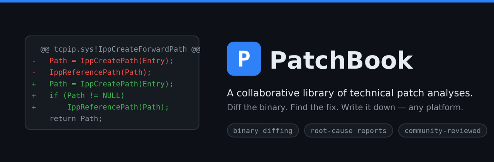

<p align="center">
  
</p>

<p align="center">
  <a href="https://cvepatchbook.com"></a>
  <a href="https://github.com/TzviRonen/PatchBook/actions/workflows/pages.yml"></a>
  
  <a href="#contributing"></a>
</p>

**PatchBook** is a collaborative, open library of technical patch analyses. Each
report takes a real security patch, diffs the shipped binary against its
predecessor, pins down the changed code, and explains what the fix actually does
— root cause, patch mechanics, and exploitation primitives. Reports may be
written by a human researcher or produced by an automated tool; either way they
carry the same structure, and the community reviews them the same way.

It is **not limited to any one platform** — Windows kernel patches are just where
the library started — and it is **not an "AI content" site**: authorship is
irrelevant, technical correctness is what matters, and every report can be voted
on and corrected by readers.

[Live site](https://cvepatchbook.com) · [Browse reports](https://cvepatchbook.com/windows/) · [Publish a report](https://cvepatchbook.com/publish/) · [About](https://cvepatchbook.com/about/)

---

## What's in a report

Every report is a Markdown file with Jekyll frontmatter, rendered into a
consistent layout:

- **Overview** — the vulnerability class, affected component, and severity.
- **The diff** — the changed functions, before and after.
- **Root cause & patch mechanics** — why the bug existed and what the fix changes.
- **Exploitation notes** — reachability and primitives, where relevant.

Readers keep reports honest through two channels, described under
[Contributing](#contributing): **votes** (instant, one per GitHub account) and
**edit suggestions** (via pull request).

## Run the site locally

You only need Ruby + Jekyll; the two scripts below handle the rest.

```bash
git clone https://github.com/TzviRonen/PatchBook.git
cd PatchBook
./setup.sh      # one-time: install the Ruby + Jekyll toolchain (idempotent)
./serve.sh      # build + serve with live reload
```

`serve.sh` prints a local URL (e.g. `http://localhost:4000/`) and rebuilds on
every edit to reports, layouts, or CSS — just refresh. Locally the site is
served from the root; in production it lives at the apex domain, so no base path
is needed.

To bring up the site **and** the vote API together for full-stack work:

```bash
./scripts/start_dev.sh        # site + local vote API, wired together
```

## Contributing

There are three ways to contribute, in rough order of effort.

### 1. Vote on a report

Every report has a **Community check** bar with `Valid` and `AI-slop` buttons and
a live count. Voting takes one GitHub login (OAuth, no scopes); the count updates
instantly, one vote per account per report. Voting again changes your verdict;
clicking the verdict you already hold retracts it. Hovering the count shows who
voted.

### 2. Suggest an edit

**Edit on GitHub** on any report opens the web editor on its source; saving
auto-forks and opens a pull request. It appears on the site once merged and Pages
rebuilds. Credit yourself by adding to the report's `editors:` frontmatter in the
same PR:

```yaml
editors:
  - name: jane-doe
    date: 2026-06-20
    note: Confirmed the double-free path.   # optional
  - some-other-user                          # bare username also works
```

### 3. Publish a new report

Use the [**Publish** page](https://cvepatchbook.com/publish/) — fill in the form
and it generates a properly-formatted file and opens a pull request for review.
Prefer to write the file by hand? Drop it in `_reports/` as
`YYYY-MM-DD-<slug>.md` with this frontmatter:

| Field | Required | Notes |
|-------|----------|-------|
| `layout` | yes | always `report` |
| `title` | yes | shown in the card and page `<title>` |
| `date` | yes | `YYYY-MM-DD` — the **patch** date; controls sort order |
| `cve_id` | no | shown as a badge |
| `cvss` | no | color-coded badge (red ≥9, orange ≥7, yellow ≥4) |
| `excerpt` | no | one or two sentences, shown on the report card |
| `editors` | no | contributor credits (see above) |

New reports are reviewed before they go live. There's no house style beyond the
report structure above — accuracy and a reproducible diff are what get a report
merged.

## Project layout

```
PatchBook/
├── _config.yml          site config (domain, github_repo, votes_api, plugins)
├── _layouts/            default / home / report templates
├── _reports/            published patch analyses (Markdown + frontmatter)
├── assets/
│   ├── main.css         design system / styling
│   └── patchbook.js     vote UI (live counts, voter popover) + edit links
├── worker/              Cloudflare Worker + D1: the vote API (see its README)
├── test/                front-end tests (jsdom, stubbed API)
├── scripts/start_dev.sh full-stack local dev (site + vote API)
├── .github/workflows/   pages.yml (build + deploy)
├── setup.sh             install Ruby + Jekyll
├── serve.sh             local preview server
└── docs/banner.png      README hero image
```

## How it's hosted

The site is a static [Jekyll](https://jekyllrb.com/) build. Pushing to `main`
triggers `.github/workflows/pages.yml`, which builds and deploys to GitHub Pages
at the custom domain **[cvepatchbook.com](https://cvepatchbook.com)**. Votes live
in a Cloudflare Worker + D1 database under `worker/` — nothing about votes is
stored in this repo, and clearing `votes_api` in `_config.yml` disables the vote
UI entirely.

## Contact

Questions or suggestions of any kind — reach out on
[LinkedIn](https://www.linkedin.com/in/tzvi-ronen/) or open an issue.
